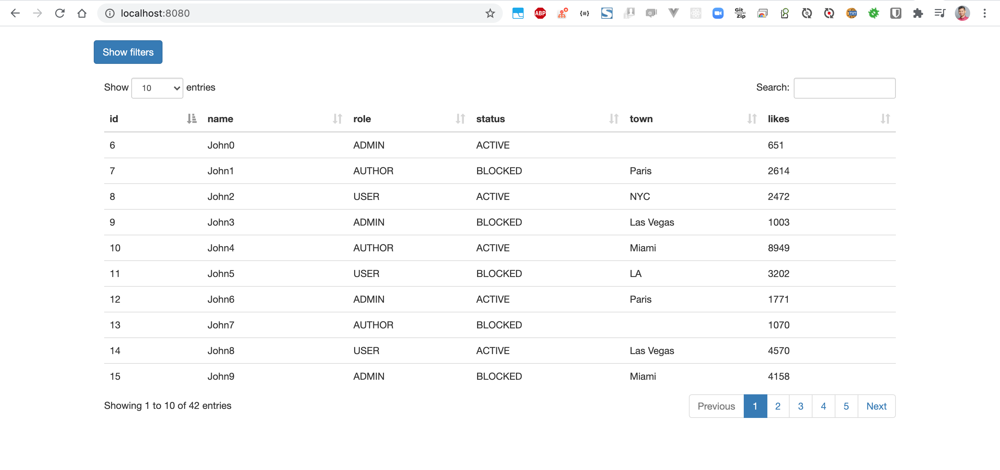
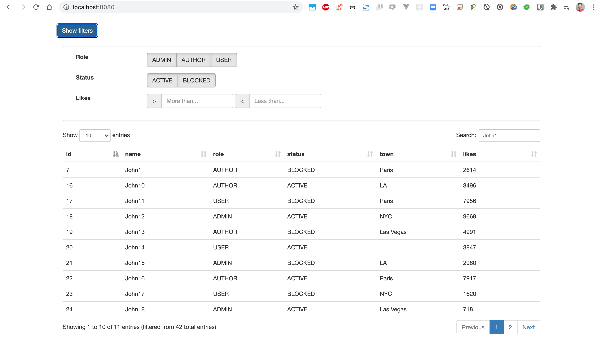

# SpringBoot-DataTable
Demo Spring Boot DataTable 

### Things to do list:
1. Clone this repository: `git clone https://github.com/hendisantika/SpringBoot-DataTable.git`
2. Go inside the folder: `cd SpringBoot-DataTable`
3. Run the application: `gradle clean bootRun --info`
4. Open your favorite browser: http://localhost:8080

### Screen shot

Home Page

